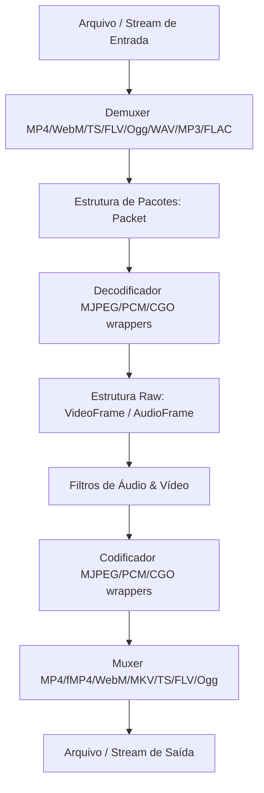

# Arquitetura do CroMedia 🏗️

Este documento descreve a arquitetura interna e o design system do CroMedia, servindo como referência técnica para desenvolvedores que queiram trabalhar no toolkit.

---

## 🗺️ Visão Geral dos Componentes

O CroMedia foi projetado para ser um toolkit modular e concorrente escrito em Go puro (com wrappers CGO opcionais). O fluxo básico de processamento segue a seguinte estrutura:

---

## 📦 Detalhes das Camadas de Software

### 1. Núcleo (Core Engine)
Localizado no pacote principal `core`, contém as definições de dados de base e gerenciamento:
- **`types.go`**: Define a estrutura central `Packet` que carrega dados codificados, timestamps (PTS/DTS) e o tipo do track.
- **`pool.go`**: Implementa o `BufferPool` utilizando buckets e `sync.Pool` para reuso dinâmico de fatias de memória, reduzindo a sobrecarga do Garbage Collector do Go.
- **`context.go`**: Gerencia contextos de pipelines (`PipelineContext`) coletando métricas de latência para cada estágio e protegendo contra falhas com `RecoverPanic`.
- **`eventbus.go`**: Barramento assíncrono para notificação de eventos e status entre componentes.

### 2. Fluxo Concorrente (Pipeline)
Localizado em `core/pipeline`:
- **`pipeline.go`**: Implementa a segmentação de GOPs (Group of Pictures) e o `WorkerPool`.
- **Ordenação Estrita**: Garante que os pacotes processados concorrentemente por múltiplas Goroutines sejam entregues na saída exatamente na ordem cronológica correta, resolvendo descompassos via buffers de reordenação.
- **Backpressure**: Usa semáforos baseados em canais para limitar o número de GOPs em trânsito simultaneamente, prevenindo estouro de memória RAM.

### 3. Demuxers e Muxers (Container I/O)
Localizados em `core/demux` e `core/mux`:
- **Sniffing**: O arquivo `sniff.go` lê os primeiros bytes do cabeçalho para identificar dinamicamente a assinatura mágica e instanciar o demuxer apropriado, sem depender de extensões.
- **Muxers**: Suportam diversos formatos incluindo gravação fragmentada de MP4 (fMP4), empacotamento EBML para WebM/MKV, alinhamento de 188 bytes para MPEG-TS, e cabeçalhos de áudio bruto (ADTS/RIFF).

### 4. Filtros e Processamento Digital
Localizados em `core/video_filter.go` e `core/audio_filter.go`:
- **Vídeo**: Filtros aplicados diretamente sobre fatias de bytes RGBA de um `VideoFrame`. A execução é otimizada dividindo as linhas de pixels (scanlines) entre múltiplas Goroutines concorrentes.
- **Áudio**: Filtros baseados em matrizes de `float32` normalizados em `[-1.0, 1.0]` com prevenção de estalos.

---

## ⚡ Aceleração por Hardware

No pacote `core/hardware`:
- **CUDA/NVENC/NVDEC**: Suporte a envio de dados RAM -> VRAM e transcodificação por hardware com stubs compiláveis em qualquer ambiente e fallbacks automáticos para CPU.
