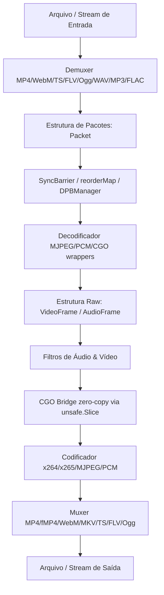

# Arquitetura do CroMedia 🏗️

Este documento descreve a arquitetura interna e o design system do CroMedia, servindo como referência técnica para desenvolvedores que queiram trabalhar no toolkit.

---

## 🗺️ Visão Geral dos Componentes

O CroMedia foi projetado para ser um toolkit modular e concorrente escrito em Go puro (com wrappers CGO opcionais). O fluxo básico de processamento segue a seguinte estrutura:

---

## 📦 Detalhes das Camadas de Software

### 1. Núcleo (Core Engine)
Localizado no pacote principal `core`, contém as definições de dados de base e gerenciamento:
- **`types.go`**: Define a estrutura central `Packet` que carrega dados codificados, timestamps (PTS/DTS) e o tipo do track.
- **`pool.go`**: Implementa o `BufferPool` utilizando buckets e `sync.Pool` para reuso dinâmico de fatias de memória, reduzindo a sobrecarga do Garbage Collector do Go. Contém rastreadores atômicos de leases e poda automática de buffers ociosos.
- **`context.go`**: Gerencia contextos de pipelines (`PipelineContext`) coletando métricas de latência para cada estágio e protegendo contra falhas com `RecoverPanic`.
- **`eventbus.go`**: Barramento assíncrono para notificação de eventos e status entre componentes.

### 2. Fluxo Concorrente, Sincronismo e Backpressure
Localizado em `core/pipeline` e no core principal:
- **`pipeline.go`**: Implementa a segmentação de GOPs (Group of Pictures) e o `WorkerPool`.
- **`syncbarrier.go`**: O `SyncBarrier` coordenada e multiplexa pacotes provenientes de múltiplos canais de entrada de forma concorrente, ordenando-os rigorosamente em ordem cronológica de PTS/DTS antes do envio ao muxer ou decoder.
- **Tratamento de Matrix Temporal**: O `reorderMap` corrige problemas de DTS desalinhado, e o `DPBManager` gerencia referências de B-Frames para decodificação precisa em tempo real.
- **Backpressure**: Usa semáforos baseados em canais para limitar o número de GOPs em trânsito simultaneamente, prevenindo estouro de memória RAM.

### 3. Demuxers e Muxers (Container I/O)
Localizados em `core/demux` e `core/mux`:
- **Sniffing**: O arquivo `sniff.go` lê os primeiros bytes do cabeçalho para identificar dinamicamente a assinatura mágica e instanciar o demuxer apropriado, sem depender de extensões.
- **Muxers**: Suportam diversos formatos incluindo gravação fragmentada de MP4 (fMP4), empacotamento EBML para WebM/MKV, alinhamento de 188 bytes para MPEG-TS, e cabeçalhos de áudio bruto (ADTS/RIFF).

### 4. Filtros e Processamento Digital
Localizados em `core/video_filter.go` e `core/audio_filter.go`:
- **Vídeo**: Filtros aplicados diretamente sobre fatias de bytes RGBA de um `VideoFrame`. A execução é otimizada dividindo as linhas de pixels (scanlines) entre Goroutines concorrentes por core.
- **Áudio**: Filtros baseados em matrizes de `float32` normalizados em `[-1.0, 1.0]` com prevenção de estalos. Suporte a normalizadores de ganho preditivos de passagem única (single-pass).

---

## ⚡ Aceleração por Hardware e CGO
No pacote `core/hardware` e `core/filters/bridge`:
- **CUDA/NVENC/NVDEC**: Suporte a envio de dados RAM -> VRAM e transcodificação por hardware com stubs compiláveis em qualquer ambiente e fallbacks automáticos para CPU.
- **Ponte CGO com `unsafe.Slice`**: Otimização de barramento que elide cópias desnecessárias na transição Go-C, permitindo que frames YUV/RGBA sejam alimentados a encoders baseados em C na velocidade nativa do hardware.

---

## 🚀 Padrões de Alta Densidade (Edge & Serverless)
A arquitetura do CroMedia foi estressada e validada para dois padrões de implantação de alto desempenho:
1. **Edge NVR / CV Gateways**: Multiplexação de centenas de streams de câmeras IP com jitter de rede em um único processo concorrente cooperativo. Menos de 30MB de RAM de footprint ativo compartilhado, ideal para dispositivos IoT (como Raspberry Pi).
2. **Serverless Scale-to-Zero**: Inicialização rápida de funções efêmeras (AWS Lambda / Google Cloud Run) com cold start Go-native sob **3ms** e pipelines de transcodificação em lote protegidos por limites de heap estritos.
